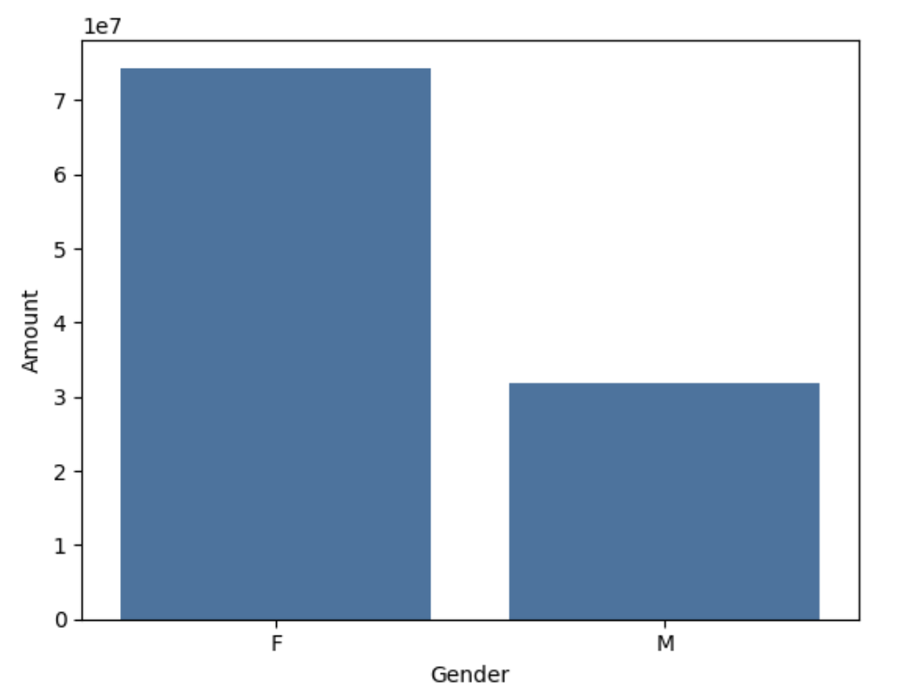
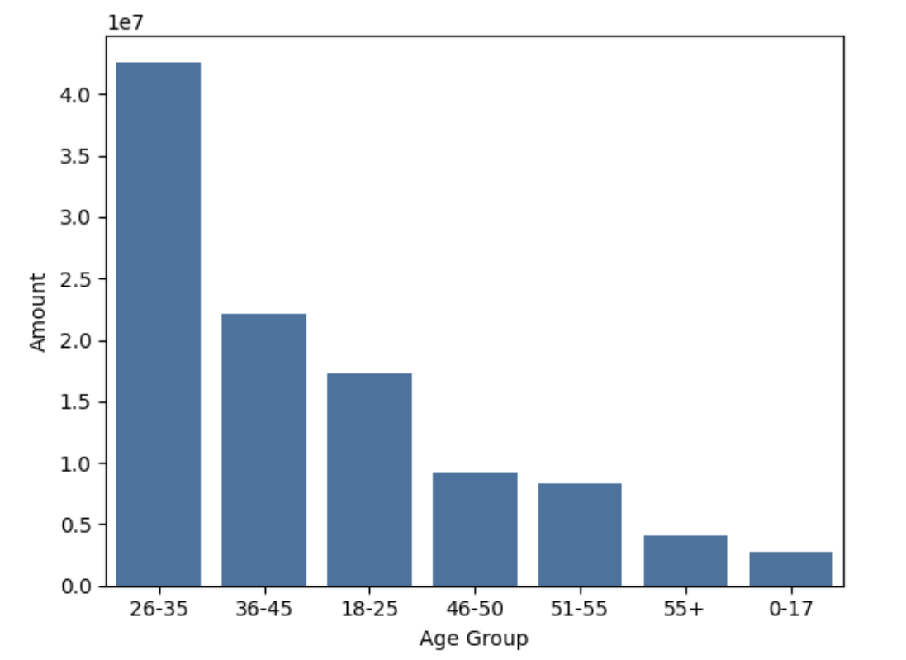
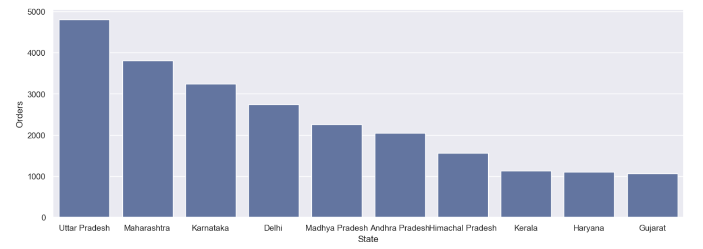
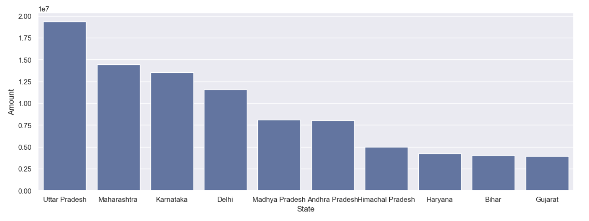
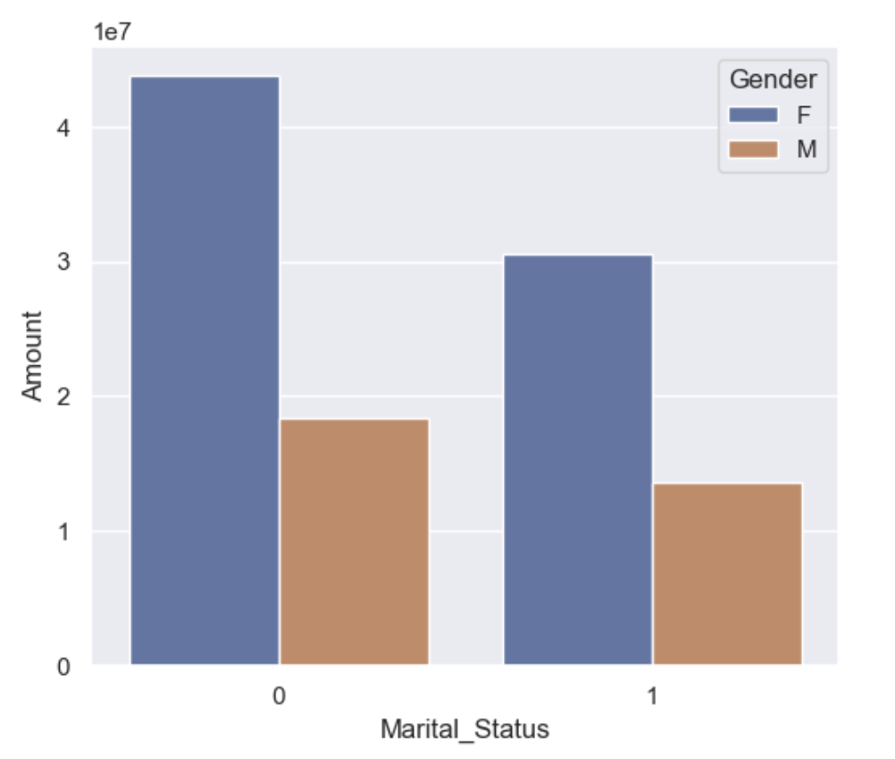
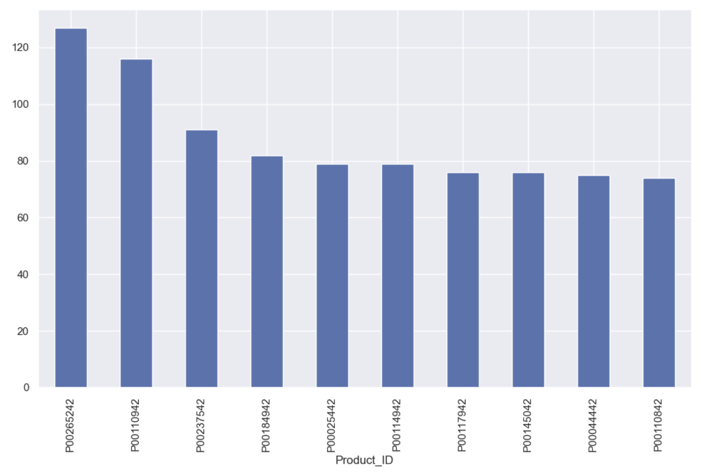

# Diwali-Sales-Analysis-Exploratory-Data-Analysis
Python project for exploratory data analysis | Beginners

This project performs end-to-end analysis of Diwali sales data to understand customer purchasing behavior and uncover key business insights. The workflow includes data cleaning, preprocessing, exploratory data analysis (EDA), and visualization using Python. The goal is to identify high-value customer segments, regional performance, and product-level trends to support data-driven decision-making.  

✅ ***Objectives***
- Clean and preprocess transactional sales data
- Analyze customer demographics, product preferences, and spending patterns
- Calculate and summarize sales metrics
- Generate visual insights using Python libraries
- Identify key customer segments to support marketing strategies  

🚀 ***Key Features in Dataset***
- Customer demographics → Gender, Age, Marital_Status, State, Zone
- Product details → Product_ID, Product_Category, Orders, Amount
- Removed unnecessary columns → Status, unnamed1
- Cleaned null values + converted datatypes  

📊 Exploratory Data Analysis (EDA) 

1️⃣ Gender-based Sales

    

📌 Female customers dominate both in count & amount spent.

2️⃣ Age Group Analysis

    

📌 Highest purchasing customers = Age 26–35, mostly women.  

3️⃣ State-wise Sales Performance

    
  

📌 Top Revenue Generating States:
1	Uttar Pradesh
2	Maharashtra
3	Karnataka  

4️⃣ Marital Status Insights

   

📌 Married women contribute the most to sales volume.  

5️⃣ Occupation vs Sales

  

📌 Highest spenders work in:
💼 IT
🏥 Healthcare
✈ Aviation  

6️⃣ Item Category & Top Products

  

📌 Best-selling categories:
🥗 Food | 👚 Clothing | 📱 Electronics  

🎯 Key Business Insights
Married women (Age 26-35) from Uttar Pradesh, Maharashtra & Karnataka, working in IT / Healthcare / Aviation, are the highest revenue-generating segment — especially purchasing Food, Clothing & Electronics.
